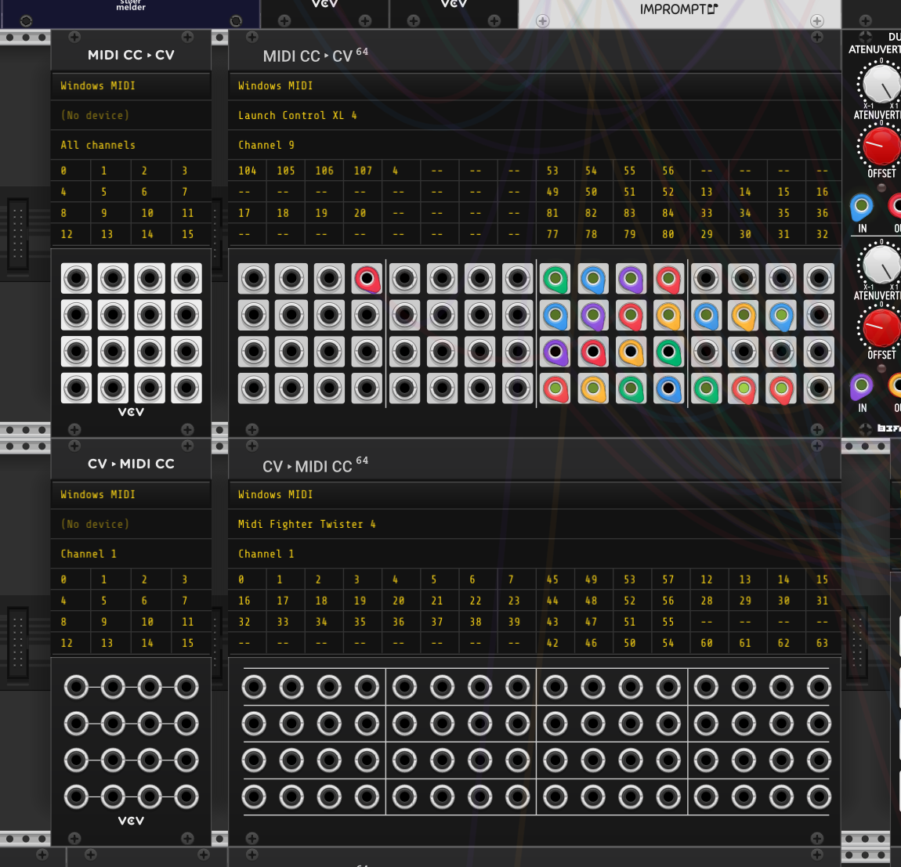

# Plugin Files

Available for Windows and Linux in the plugin-build/ folder.

Current modules:
- MIDI CC -> CV x64
- CV -> MIDI CC x64



# Building Core Plus Plugin 

```bash
unset LD_LIBRARY_PATH
sudo make dep-ubuntu
make toolchain-lin
make toolchain-win
make rack-sdk-all
make plugin-build-win-x64 PLUGIN_DIR=CorePlus/
make plugin-build-lin-x64 PLUGIN_DIR=CorePlus/
```

# VCV Rack Plugin Toolchain

**Cross-compile** VCV Rack plugins for all supported platforms with a single command on any GNU/Linux-based distribution.

**Analyze** plugin source code using open source static analysis tools (for example: cppcheck).

## Supported platforms and architectures

The following platforms and architectures are supported by the VCV Rack Plugin Toolchain:

| Platform  | Architecture |
|:---------:|:------------:|
| GNU/Linux | x64          |
| Windows   | x64          |
| macOS     | x64, arm64   |

All supported platforms and architectures will be built by **cross-compilation in a GNU/Linux-based environment**.

Cross-platform support for using the toolchain on non-GNU/Linux platforms is provided via Docker (see below).

## Building

Clone this repository in a **path without spaces**, or the Makefile will break.

Obtain `MacOSX11.1.sdk.tar.xz` using the instructions at https://github.com/tpoechtrager/osxcross#packaging-the-sdk, and place it in the root of this repository.
You must have access to a Mac computer with **Xcode 12.4** to generate this SDK package. You **must** use this specific SDK version to build the toolchains.

There are two ways to build the toolchains:
- Locally on GNU/Linux: Uses your system's compilers to build the toolchains.
- In a Docker container: This method uses a Ubuntu base image and installs all dependencies necessary to build the toolchains.

**NOTE:** The official VCV Rack plugin build system is based on Arch Linux.

### Local toolchain build

*Requires a GNU/Linux host.*

Install toolchain build dependencies.
On Arch Linux,
```bash
sudo make dep-arch-linux
```
or on Ubuntu,
```bash
sudo make dep-ubuntu
```

Build toolchains for all three platforms.
```bash
make toolchain-all
```
Each toolchain will take around an hour to build and will require network access, about 8 GB free RAM, and about 15 GB free disk space.
The final disk space after building is about 3.7 GB.

Build your plugin.
```bash
make -j$(nproc) plugin-build PLUGIN_DIR=...
```

Built plugin packages are placed in the `plugin-build/` directory.

Analyze your plugin source code.

```bash
make -j$(nproc) plugin-analyze PLUGIN_DIR=...
```

### Docker toolchain build

*Works on any operating system with [Docker](https://www.docker.com/) installed.*

**IMPORTANT:** Do **not** invoke the Docker-based toolchain with `sudo`! There is no need to do so and it will not work correctly.

Instead, follow the instructions to let non-root users manage Docker containers: https://docs.docker.com/engine/install/linux-postinstall/

Build the Docker container with toolchains for all platforms.
```bash
make docker-build
```

*Optional*: Pass number of jobs to use to for the tool chain build with the `JOBS` environment variable.
```bash
JOBS=$(nproc) make docker-build
```
(Just passing `-j$(nproc)` directly will not work due to the different build systems used in the toolchain build process.)

Build your plugin.


```bash
make -j$(nproc) docker-plugin-build PLUGIN_DIR=...
```

Built plugin packages are placed in the `plugin-build/` directory.

Analyze plugin source code.

```bash
make -j$(nproc) docker-plugin-analyze PLUGIN_DIR=...
```

#### Notes for building and using the Docker-based toolchain on macOS

- Ensure that Docker Desktop has sufficient amount of resources (RAM, disk space) allocated to build the toolchain!
- You may have to add `MAKE=make` to the build command::

```bash
MAKE=make make -j$(nproc) docker-plugin-build PLUGIN_DIR=...
```

### Rack SDK management

The latest Rack SDKs for all supported platforms are downloaded during the toolchain build.

The SDKs can be updated to the latest version (defined in the `Makefile`) as follows:

```bash
make rack-sdk-clean
make rack-sdk-all
```

This is especially convenient for the Docker-based toolchain, because it does not require to rebuild the entire toolchain to update to the latest SDK.

## Acknowledgments

Thanks to @cschol for help with crosstool-ng, Ubuntu, Docker, and testing.
